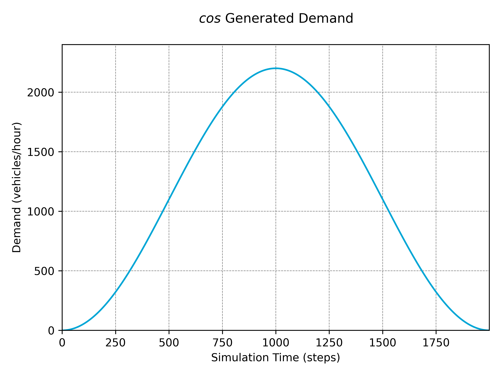

# Basic Simulations

## SUMO Scenarios

Before anything can be simulated, all the necessary SUMO scenario files are required. This will typically include a '_.sumocfg_', '_.neteditcfg_', '_.net.xml_', '_.rou.xml_' and '_.add.xml_'. The simplest way to create a scenario and these files is using netedit, about which there is more information [here](https://sumo.dlr.de/docs/Netedit/index.html).

## Initialising the Simulation

All simulations in TUD-SUMO are created and run using the `Simulation` class, which is initialised as below. A scenario name and description are optional, but can be useful when running multiple similar simulations.

```python
from tud_sumo.simulation import Simulation

my_sim = Simulation(scenario_name="example", scenario_desc="Example simulation.")
```

To then start the simulation and create the connection to SUMO through TraCI, use `Simulation.start()`. This can very easily be done using the '_.sumocfg_' file created by netedit, which links all to all other files, however, the `net_file`, `route_file`, `add_file` and `gui_file` parameters can also be used to give each file individually. Whether or not to use the GUI is also set here, although note this cannot be changed throughout the simulation.

```python
my_sim.start("example_scenario.sumocfg",
             gui=True,
             get_individual_vehicle_data=False,
             units="metric",
             suppress_pbar=False,
             seed=1
            )
```

The `get_individual_vehicle_data` is an important parameter denoting whether to collect and save dynamic information for all vehicles (ie. position, speed, acceleration etc.) at each step. This can be useful for small scenarios where this data may be required and computation time is less of an issue, such as single intersections, however, this should be set to false for large scenarios, such as large motorway networks.

3 unit settings are supported '_metric_' (km/kmph), '_imperial_' (mi/mph) and '_UK_' (km/mph). All data collected and saved are in these units, and this setting cannot be changed later.

The `seed` parameter is optional and affects both the SUMO simulation and the `Simulation` class. Random seeds in SUMO primarily affects how vehicles are added into the simulation (more information can be found [here](https://sumo.dlr.de/docs/Simulation/Randomness.html)). The seed can be set to random either by not using the parameter or by setting it to '_random_'.

By default, a progress bar is automatically created when simulating more than 10 steps at a time. This can be skipped by setting `suppress_pbar = False`. 

Tracked junctions/edges, controllers etc. can be initialised at this point. These objects can be added individually, or if all of their parameters are saved in a dictionary or '_.json_' or '_.pkl_' file, these can be read using the `Simulation.load_objects()` function. This dictionary can be created manually, or can be saved with `Simulation.save_objects()` for ease of use. An example of this resulting file can be found [here](https://github.com/DAIMoNDLab/tud-sumo-examples/blob/main/a20_example/objects.json), otherwise, more information on the objects themselves can be found in their respective sections.

```python
# Save object initialisation parameters
my_sim.save_objects("objects.pkl")

# Initialise objects using the same parameters
my_sim.load_objects("objects.pkl")
```

The following objects can be included in this dictionary:

  - '_edges_': List of edge IDs for tracking.
  - '_junctions_': [Tracked junction](5_tracked_objs.md/#tracked-junctions) initialisation parameters.
  - '_phases_': Traffic light [phase dictionary](6_traffic_control.md/#traffic-signal-control).
  - '_controllers_': Dictionary containing [VSL](6_traffic_control.md/#variable-speed-limits) and/or [RG](6_traffic_control.md/#dynamic-route-guidance) controller parameters.
  - '_events_': Dictionary containing [scheduled event](7_events.md/#scheduled-events) parameters (previous dynamic events are saved in the resulting file).
  - '_demand_': A '_.csv_' filename (or list of filenames) for OD matrices.
  - '_routes_': A dictionary containing new routes by their ID and a (2x1) array representing the origin and destination.

## Adding Demand

There are two approaches to adding demand to a simulation. The default approach is to define demand with routes or by flow within a '_.rou.xml_' file, in which case, nothing else needs to be done. Alternatively, demand can be generated more dynamically within TUD-SUMO. This is done with either `Simulation.load_demand()`, `Simulation.add_demand()` or `Simulation.add_demand_function()`.

!!! warning

    When adding demand using `Simulation.load_demand()` or `Simulation.add_demand()`, custom vehicle types and routes will still need to be pre-defined in a '_.rou.xml_' file. Any trips defined in this file will also still occur.

`Simulation.load_demand()` can be used to load a pre-defined demand profile from a '_.csv_' file, in the format below. For a route, either an '_origin_' and '_destination_' or a '_route_id_' is required. If using a route ID, the route must be pre-defined in the '_.rou.xml_' file. A time range for the demand is also required, either with a '_start_time/end_time_' or '_start_step/end_step_'. The demand value can either be given as a flow value in vehicles/hour under '_demand_' or as a raw number of vehicles under '_number_'.

If a flow value is given, vehicles are spawned throughout the demand period at this specified rate. Vehicles are inserted into the simulation using a Gaussian distribution with an average of '_demand_' vehicle per hour. '_insertion_sd_' is an optional float parameter that can be used to change the standard deviation of this distribution, and defaults to 1/3. Note that the actual standard deviation used is calculated using _demand * insertion_sd_. When the vehicles per step is below 1, vehicles are inserted at each step with this rate as a probability.

The other parameters are optional. '_vehicle_types_' can be a list of vehicle type IDs or a single ID and can optionally be given with '_vehicle_type_dists_'. When adding demand of multiple potential vehicle types, this allows for the distribution of types to be defined. If '_vehicle_types_', the default vehicle type is used, and when '_vehicle_types_' is given without a '_vehicle_type_dists_', vehicle types have an equal distribution. '_initial_speed_' defines the initial speed of vehicles at insertion and can either be '_max_', '_random_' or a number > 0, but defaults to '_max_'. '_origin_lane_' defines which lane vehicles are inserted at. This can either be '_random_', '_free_', '_allowed_', '_best_', '_first_' or a specific lane index, but defaults to '_best_'. '_origin_pos_' defines the longitudinal position on the lane vehicles are inserted at. This can either be '_random_', '_free_', '_random\_free_', '_last_', '_stop_', '_splitFront_' or a specific position, but defaults to '_base_'.

More in-depth descriptions of the possible values can be found [here](https://sumo.dlr.de/docs/Definition_of_Vehicles%2C_Vehicle_Types%2C_and_Routes.html#a_vehicles_depart_and_arrival_parameter).

Two examples of the contents of a '_demand.csv_' file are shown below. It is possible to link a demand file in an object parameters dictionary under '_demand_' when calling `Simulation.load_objects()`.

| origin | destination | start_time | end_time | demand |    vehicle_types    | vehicle_type_dists |
|:------:|:-----------:|:----------:|:--------:|:------:|:-------------------:|:------------------:|
| edge_1 |   edge_10   |      0     |    600   |  1200  | "cars,vans,lorries" |    "0.7,0.2,0.1"   |
|   ...  |     ...     |     ...    |    ...   |   ...  |         ...         |         ...        |

| route_id | start_step | end_step | number | initial_speed | origin_lane | origin_pos | insertion_sd |
|:--------:|:----------:|:--------:|:------:|:-------------:|:-----------:|:----------:|:------------:|
|  route_1 |      0     |   1200   |   200  |      max      |      1      |   random   |      0.3     |
|    ...   |     ...    |    ...   |   ...  |      ...      |     ...     |     ...    |      ...     |

Demand can also be added in code using the `Simulation.add_demand()` function. This uses the same set of parameters as the demand files above, except '_origin/destination/route_id_' is replaced by a single `routing` parameter, and `step_range` is used instead of '_start_time/end_time_' or '_start_step/end_step_'. Demand is also defined as a flow rate in vehicles/hour. Examples are shown below.

```python
my_sim.add_demand(routing=("edge_1", "edge_10"),
                  step_range=(0, 1200),
                  demand=1200,
                  vehicle_types=["cars", "vans", "lorries"],
                  vehicle_type_dists=[0.7, 0.2, 0.2]
                 )

my_sim.add_demand(routing="route_1",
                  step_range=(0, 1200),
                  demand=200,
                  initial_speed="max",
                  origin_lane=1
                 )
```

Lastly, demand can be added using a demand function that calculates demand based on the step number. This is done using the `Simulation.add_demand_function()` function, which again uses the same parameters as `Simulation.add_demand()`, except `demand` is replaced by `demand_function` and `parameters`. `demand_function` is a function that takes `step`, the step number, as a parameter and outputs a flow value based on this. Other parameters can be passed into the function using a `parameters` dictionary.

An example of this is shown below, where a demand function `cos()` generates a demand profile using a cosine function.

```python

def cos(step, peak, end_step=2000):
    return (peak / 2) * (1 - math.cos((2 * math.pi * step) / end_step))

my_sim.add_demand_function(("E1", "E2"), (0, 2000), cos, {"peak": 2200}, vehicle_types="cars")
```



!!! warning

    Adding demand dynamically (`Simulation.load_demand()` and `Simulation.add_demand()`) reduces performance compared to pre-defined demand in a '_.rou.xml_' file. Average trip times will also be longer as vehicles added this way are registered when they are loaded, not when they are inserted.

## Running the Simulation

The simulation is run using the `Simulation.step_through()` function. When no parameters are given, the simulation will run through one step by default. Otherwise, using `n_steps` will run the simulation for a specific number of steps, `end_step` will run the simulation until a specific step and `n_seconds` will run the simulation for a specific amount of time (in seconds).

```python
# Run 1 step
my_sim.step_through()

# Run for 100 steps
my_sim.step_through(100)

# Run until step 200
my_sim.step_through(end_step=200)

# Run for 100 seconds (where step length = 0.5)
my_sim.step_through(n_seconds=200)
```

A control loop can, therefore, be created as below. A progress bar is automatically created when simulating for 10 or more steps in one call of `Simulation.step_through()`. In order to create a progress bar that is consistent between separate calls, use the `pbar_max_steps` parameter and set this to the total length of the simulation.

```python
n, sim_dur = 100, 2500
while my_sim.curr_step < sim_dur: # or use my_sim.curr_time

    # Step through n steps.
    my_sim.step_through(n_steps=n, pbar_max_steps=sim_dur)

    # Perform control
    # ...
```

To include a warmup period where no data is collected, set `keep_data = True`.

```python
warmup_length = 120
my_sim.step_through(n_seconds=warmup_length, keep_data=True)
```

## Ending the Simulation

A simulation can be run until it is finished as below. The `Simulation.is_running()` function returns false once the simulation is over, which is determined as happening once all defined vehicles have finished their run through the simulation. It is then best to end the simulation using `Simulation.end()`, which closes the connection to TraCI.

```python
while my_sim.is_running():
    my_sim.step_through()

my_sim.end()
```

## Automatic Data Collection

One of the major advantages of TUD-SUMO is the automatic data collection. This involves automatically collecting all basic simulation information into a `sim_data` dictionary. An example of this can be seen in examples directory in the main TUD-SUMO repository, however, the main structure is as follows:

```JSON
{
    "data":
        {
            "detectors": {},
            "junctions": {},
            "edges": {},
            "controllers": {},
            "vehicles": {},
            "demand": {},
            "trips": {},
            "events": {},
            "all_vehicles": {}
        },
    "start": 0,
    "end": 1000,
    "step_len": 1.0,
    "units": "METRIC",
    "seed": 10,
    "sim_start": "08/07/2024, 13:00:00",
    "sim_end": "08/07/2024, 13:00:10"
}
```

Detectors will automatically collect vehicle speeds and counts for each time step, as well as the IDs of each vehicle that passed over it, whilst occupancies are also collected for mutli-entry-exit detectors. These will be stored under '_data/detectors/{detector_id}_', with '_type_', '_position_', '_speeds_', '_vehicle_counts_', '_vehicle_ids_' and '_occupancies_'.

Vehicle data will include the number of vehicles at each step, '_tts_' (N. vehicles * step length) and '_delay_' (calculated as the time spent by vehicles waiting in each time step).

Demand is only included when dynamically adding demand, ie. not when demand is solely defined in the '_.rou.xml_' file. This dictionary will contain two objects; '_headers_' and a '_table_'. '_table_' will contain a (6 x n) sized array, with its headers listed under '_headers_'. Only demand added through `Simulation.load_demand()` and `Simulation.add_demand()` will be included here.

Trip data will contain data for incomplete and completed trips. This is stored under '_data/trips_' and then either '_incomplete_' or '_completed_'. Each trip will store the '_route_id_', '_vehicle_type_', '_departure_', '_arrival_' (or removal), '_origin_' and '_destination_'.

Junction, edge, controller and event data are only included when necessary. The `all_vehicles` data will contain all the individual vehicle data at each time step, so it is only included when `get_individual_vehicle_data` is set to true when starting the simulation.

The `sim_data` dictionary can be reset at any point using the `Simulation.reset_data()` function.

```python
my_sim.reset_data()
```

## Saving & Summarising Data

All the data collected throughout the simulation can be saved at any point using the `Simulation.save_data()` function. This will save the `sim_data` dictionary as a file in the specified directory. Either JSON or pickle files are supported, simply denoted by a '_.json_' or '_.pkl_' extension in the filename.

```python
my_sim.save_data("data/example_data.json")
my_sim.save_data("data/example_data.pkl")
```

All data saved by a simulation or a simulation data file can be summarised using the `Simulation.print_summary()` or `print_summary()` functions. This will print a summary of the collected data (ie. number of vehicles, TTS, controllers, events etc.), as well as some information about the simulation itself (ie. scenario name/description, runtime, seed etc.). This summary can be saved to a '_.txt_' file using the `save_file` parameter. An example summary is shown below.

```python
my_sim.print_summary(save_file="data/example_summary.txt")

# Print summary without creating a Simulation object
from tud_sumo.simulation import print_summary
print_summary("data/example_data.pkl")
```

```
 *============================================================*
 |                          A20_ITCS                          | 
 *============================================================*
 |                        Description:                        | 
 |   Example traffic controllers, with 2 ramp meters, 1 VSL   | 
 |        controller and 1 route guidance controller.         | 
 *============================================================*
 |                 Simulation Run: 10/07/2024                 | 
 |               12:02:14 - 12:02:25 (0:00:11)                | 
 *------------------------------------------------------------*
 | Number of Steps:                                       500 | 
 | Step Length:                                           1.0 | 
 | Avg. Step Duration:                                 0.022s | 
 | Units Type:                              Metric (km, km/h) | 
 | Seed:                                                    1 | 
 *============================================================*
 |                            Data                            | 
 *============================================================*
 |                        Vehicle Data                        | 
 *------------------------------------------------------------*
 | Avg. No. Vehicles:                                  774.66 | 
 | Peak No. Vehicles:                                    1277 | 
 | Avg. No. Waiting Vehicles:                           34.26 | 
 | Peak No. Waiting Vehicles:                             104 | 
 | Final No. Vehicles:                                   1277 | 
 | Individual Data:                                        No | 
 * ---------------------------------------------------------- *
 | Total TTS:                                       387332.0s | 
 | Total Delay:                                      17132.0s | 
 *------------------------------------------------------------*
 |                         Trip Data                          | 
 *------------------------------------------------------------*
 | Incomplete Trips:                             1281 (67.2%) | 
 | Completed Trips:                               625 (32.8%) | 
 *------------------------------------------------------------*
 |                         Detectors                          | 
 *------------------------------------------------------------*
 |               Induction Loop Detectors: (15)               | 
 |       a13_ramp_inflow, cw_down_occ_0, cw_down_occ_1,       | 
 |  cw_down_occ_2, cw_down_occ_3, cw_up_occ_0, cw_up_occ_1,   | 
 |      cw_up_occ_2, rerouter_2, utsc_e_in, utsc_e_out,       | 
 |      utsc_n_in_1, utsc_n_in_2, utsc_w_in, utsc_w_out       | 
 |                                                            | 
 |              Multi-Entry-Exit Detectors: (7)               | 
 |    a13_ramp_queue, a13_rm_downstream, a13_rm_upstream,     | 
 |      cw_ramp_inflow, cw_ramp_queue, cw_rm_downstream,      | 
 |                       cw_rm_upstream                       | 
 *------------------------------------------------------------*
 |                       Tracked Edges                        | 
 *------------------------------------------------------------*
 | 126730026, 1191885773, 1191885771, 126730171, 1191885772,  | 
 |         948542172, 70944365, 308977078, 1192621075         | 
 *------------------------------------------------------------*
 |                     Tracked Junctions                      | 
 *------------------------------------------------------------*
 |                     utsc (Signalised)                      | 
 |           crooswijk_meter (Signalised, Metered)            | 
 |              a13_meter (Signalised, Metered)               | 
 *------------------------------------------------------------*
 |                        Controllers                         | 
 *------------------------------------------------------------*
 |                    Route Guidance: (1)                     | 
 |                          rerouter                          | 
 |                                                            | 
 |                 Variable Speed Limits: (1)                 | 
 |                            vsl                             | 
 *------------------------------------------------------------*
 |                    Event IDs & Statuses                    | 
 *------------------------------------------------------------*
 |                 Active: incident_response                  | 
 |             Completed: incident_1, bottleneck              | 
 *------------------------------------------------------------*
```

The structure of a simulation data file can also be printed using the `Simulation.print_sim_data_struct()` or `print_sim_data_struct()` functions. This will print the structure of the `sim_data` dictionary as a tree, allowing you to see the exact keys and data types used in the data. An example of the output of `print_sim_data_struct()` is shown below.

Note that the dimensions of array are only displayed up to 2D. If an array has a higher dimension, this is denoted by a '_+_'. If the array is inhomogeneous (ie. its dimensions are inconsistent), this is denoted by a '_*_' and the array's maximum size is shown.

```python
my_sim.print_sim_data_struct()

# Print structure without creating a Simulation object
from tud_sumo.simulation import print_sim_data_struct
print_sim_data_struct("data/example_data.pkl")
```

```
A20_ITCS:
  ├─- scenario_name: str
  ├─- scenario_desc: str
  ├─- data:
  |     ├─- detectors:
  |     |     ├─- a13_ramp_queue:
  |     |     |     ├─- type: str
  |     |     |     ├─- position:
  |     |     |     |     ├─- entry_lanes: list (1x1)
  |     |     |     |     ├─- exit_lanes: list (1x1)
  |     |     |     |     ├─- entry_positions: list (1x1)
  |     |     |     |     └─- exit_positions: list (1x1)
  |     |     |     ├─- speeds: list (1x500)
  |     |     |     ├─- vehicle_counts: list (1x500)
  |     |     |     ├─- vehicle_ids: list (500x27*)
  |     |     |     └─- occupancies: list (1x0)
  .     .     .
  .     .     .
  .     .     .
  |     ├─- vehicles:
  |     |     ├─- no_vehicles: list (1x500)
  |     |     ├─- no_waiting: list (1x500)
  |     |     ├─- tts: list (1x500)
  |     |     └─- delay: list (1x500)
  |     ├─- trips:
  |     |     ├─- incomplete: dict (1x1311)
  |     |     └─- completed: dict (1x601)
  |     └─- events:
  |           ├─- scheduled: list (1x1)
  |           ├─- active: list (1x1)
  |           └─- completed: list (1x1)
  ├─- start: int
  ├─- end: int
  ├─- step_len: float
  ├─- units: str
  ├─- seed: int
  ├─- sim_start: str
  └─- sim_end: str
```