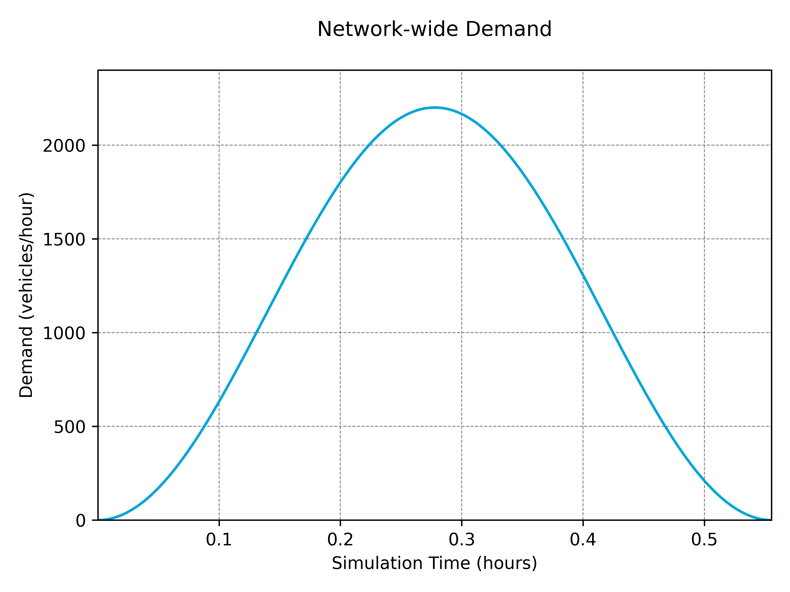

## Demand Profiles

There are two approaches to adding demand to a simulation. The default approach is to define demand with routes or by flow within a '_.rou.xml_' file, in which case, nothing else needs to be done. Alternatively, demand can be generated more dynamically within TUD-SUMO. This is done using a `DemandProfile` object, intialised as below with a corresponding `Simulation` object.

```python
from tud_sumo.simulation import Simulation
from tud_sumo.demand import DemandProfile

my_sim = Simulation(scenario_name="example", scenario_desc="Example simulation.")
my_sim.start("example_scenario.sumocfg")

dp = DemandProfile(my_sim)
dp2 = DemandProfile(my_sim)
```

Once the profile has been created, there are 3 ways to add demand; `DemandProfile.load_demand()`, `DemandProfile.add_demand()` or `DemandProfile.add_demand_function()`. All demand from a profile can also be plotted using `DemandProfile.plot_demand()` or `Plotter.plot_demand()`.

Multiple demand profiles can be added to one simulation object, and can be controlled independently.

### Loading Demand

`DemandProfile.load_demand()` can be used to load a pre-defined demand profile from a '_.csv_' file, in the format below. For a route, either an '_origin_' and '_destination_' or a '_route_id_' is required. If using a route ID, the route must be pre-defined in the '_.rou.xml_' file. A time range for the demand is also required, either with a '_start_time/end_time_' or '_start_step/end_step_'. This time range is defined in **seconds**. The demand value can either be given as a flow value in vehicles/hour under '_demand_' or as a raw number of vehicles under '_number_'.

```python
# Add multiple demands to the same profile
dp.load_demand("base_demand.csv")
dp.load_demand("peak_demand.csv")
```

If a flow value is given, vehicles are spawned throughout the demand period at this specified rate. Vehicles are inserted into the simulation using a Gaussian distribution with an average of '_demand_' vehicle per hour. '_insertion_sd_' is an optional float parameter that can be used to change the standard deviation of this distribution, and defaults to 1/3. Note that the actual standard deviation used is calculated using _demand * insertion_sd_. When the vehicles per step is below 1, vehicles are inserted at each step with this rate as a probability.

The other parameters are optional. '_vehicle_types_' can be a list of vehicle type IDs or a single ID and can optionally be given with '_vehicle_type_dists_'. When adding demand of multiple potential vehicle types, this allows for the distribution of types to be defined. If '_vehicle_types_', the default vehicle type is used, and when '_vehicle_types_' is given without a '_vehicle_type_dists_', vehicle types have an equal distribution. '_initial_speed_' defines the initial speed of vehicles at insertion and can either be '_max_', '_random_' or a number > 0, but defaults to '_max_'. '_origin_lane_' defines which lane vehicles are inserted at. This can either be '_random_', '_free_', '_allowed_', '_best_', '_first_' or a specific lane index, but defaults to '_best_'. '_origin_pos_' defines the longitudinal position on the lane vehicles are inserted at. This can either be '_random_', '_free_', '_random\_free_', '_last_', '_stop_', '_splitFront_' or a specific position, but defaults to '_base_'. '_colour_' can either be a hex code, list of RGB(A) values or a valid sumo colour.

More in-depth descriptions of the possible values can be found [here](https://sumo.dlr.de/docs/Definition_of_Vehicles%2C_Vehicle_Types%2C_and_Routes.html#a_vehicles_depart_and_arrival_parameter). Two examples of the contents of a '_demand.csv_' file are shown below.

| origin | destination | start_time | end_time | demand |    vehicle_types    | vehicle_type_dists | colour |
|:------:|:-----------:|:----------:|:--------:|:------:|:-------------------:|:------------------:|:------:|
| edge_1 |   edge_10   |      0     |    600   |  1200  | "cars,vans,lorries" |    "0.7,0.2,0.1"   |  red   |
|   ...  |     ...     |     ...    |    ...   |   ...  |         ...         |         ...        |  ...   |

| route_id | start_step | end_step | number | initial_speed | origin_lane | origin_pos | insertion_sd |
|:--------:|:----------:|:--------:|:------:|:-------------:|:-----------:|:----------:|:------------:|
|  route_1 |      0     |   1200   |   200  |      max      |      1      |   random   |      0.3     |
|    ...   |     ...    |    ...   |   ...  |      ...      |     ...     |     ...    |      ...     |

### Adding Flows

Demand can also be added using the `DemandProfile.add_demand()` function. This uses the same set of parameters as the demand files above, except '_origin/destination/route_id_' is replaced by a single `routing` parameter, and `step_range` is used instead of '_start_time/end_time_' or '_start_step/end_step_'. Demand is defined as a flow rate in vehicles/hour. Examples are shown below.

```python
# Add vehicles, allowing them to use the most optimal route
# between 'edge_1' and 'edge_10' (found based on current conditions)
dp.add_demand(routing=("edge_1", "edge_10"),
              step_range=(0, 1200),
              demand=1200,
              vehicle_types=["cars", "vans", "lorries"],
              vehicle_type_dists=[0.7, 0.2, 0.2],
              colour="#FF0000"
             )

# Add vehicles to a specific (pre-defined) route
dp.add_demand(routing="route_1",
              step_range=(0, 1200),
              demand=200,
              initial_speed="max",
              origin_lane=1,
              colour="magenta"
             )
```

### Demand Functions

Lastly, demand can be added using a demand function that calculates demand based on the step number. This is done using the `DemandProfile.add_demand_function()` function, which again uses the same parameters as `DemandProfile.add_demand()`, except `demand` is replaced by `demand_function` and `parameters`. `demand_function` is a function that takes `step`, the step number, as a parameter and outputs a flow value based on this. Other parameters can be passed into the function using a `parameters` dictionary.

An example of this is shown below, where a demand function `cos()` generates a demand profile using a cosine function.

```python
def cos(step, peak, end_step=2000):
    return (peak / 2) * (1 - math.cos((2 * math.pi * step) / end_step))

dp.add_demand_function(("edge1", "edge10"), (0, 2000), cos, {"peak": 2200}, vehicle_types="cars")
dp.plot_demand()
```



### Removing Demand

Demand can be removed from a profile using the `DemandProfile.remove_demand()` function. This will remove all demand in the profile in a specific time range, defined in **seconds**. An example of this is shown below.

```python
def cos(step, peak, end_step=2000):
    return (peak / 2) * (1 - math.cos((2 * math.pi * step) / end_step))

dp.add_demand_function(("edge1", "edge10"), (0, 2000), cos, {"peak": 2200}, vehicle_types="cars")

# Remove all demand from the profile betwen 500-1000 seconds
dp.remove_demand(500, 1000)
dp.plot_demand()
```


### Saving & Loading Profiles

Demand profiles can either be saved individually using `DemandProfile.save()`, which will save the profile as a serialised '_.pkl_' file, or using `Simulation.save_objects()`, which will save the profile alongside other objects (such as controllers). An example of this is shown below.

```python
# Load demand from a '.csv' file
dp.load_demand("demand.csv")

# Save to a serialised file
dp.save("demand_profile_1.pkl")

# Save as part of an objects file
my_sim.save_objects("all_objects.json")
```

Loading a demand profile is done from a `Simulation` object using the `Simulation.load_demand_profiles()` or `Simulation.load_objects()` functions. If loading an individual profile, ensure the routes are valid for the simulation. Any vehicle types created for the profile will be recreated.

```python
# Load two demand profiles into the simulation
demand_profiles = my_sim.load_demand_profiles(["demand_profile_1.pkl", "demand_profile_2.pkl"])
demand_profiles[0].load_demand("peak_demand.pkl")

# Load objects into the simulation, including any added demand profiles
my_sim.load_objects("all_objects.json")
```

Alternatively, a `DemandProfile` object can be converted into a '_.rou.xml_' file, using the `DemandProfile.create_route_file()` function. This will save any demand added to the profile as a route file that can be used within SUMO. This can be beneficial as demand defined this way will run much faster than using solely `DemandProfile` objects.

```python
dp.create_route_file("demand.rou.xml")

new_sim = Simulation(scenario_name="example", scenario_desc="Example simulation.")
new_sim.start("example_scenario.sumocfg", route_file="demand.rou.xml")
```

Note that data from vehicles added through a `DemandProfile` will be slightly different to those in a '_.rou.xml_' due to the way vehicles are inserted. In heavy traffic conditions, average trip times may also be much larger with a `DemandProfile` object as trip times are calculated using their scheduled entry into the simulation, and does not account for any insertion delay.

## Vehicle Types

Vehicle types can be added to a `DemandProfile` using the `DemandProfile.add_vehicle_type()` function. The parameters are the same as in `Simulation.add_vehicle_type()`, outlined [here](5_interactions.md/#custom-vehicle-types). Any vehicle types added to a demand profile are saved along with the profile and added to any '_.rou.xml_' files created from the profile. An example of this is shown below.

```python
my_sim = Simulation(scenario_name="example", scenario_desc="Example simulation.")
my_sim.start("example_scenario.sumocfg")

# Create a custom white 'vans' vehicle type to the demand profile
dp.add_vehicle_type("vans", "delivery", colour="white", min_gap=0.5)

# Load demand from a '.csv' file
dp.load_demand("demand.csv")

# Save to a serialised file
dp.save("demand_profile.pkl")

# Create a '.rou.xml' file, containing 'vans' vehicle type
dp.create_route_file("routes.rou.xml")

# Create a new/separate simulation object
new_sim = Simulation(scenario_name="example", scenario_desc="Example simulation.")
new_sim.start("example_scenario.sumocfg")

# Load the profile and 'vans' vehicle type into the new simulation
new_dp = new_sim.load_demand_profiles("demand_profile.pkl")
```

Once a vehicle type has been added to a demand profile, any other demand profile linked to the same `Simulation` object can use this same vehicle type. However, these new types are not saved to any of the other profiles.