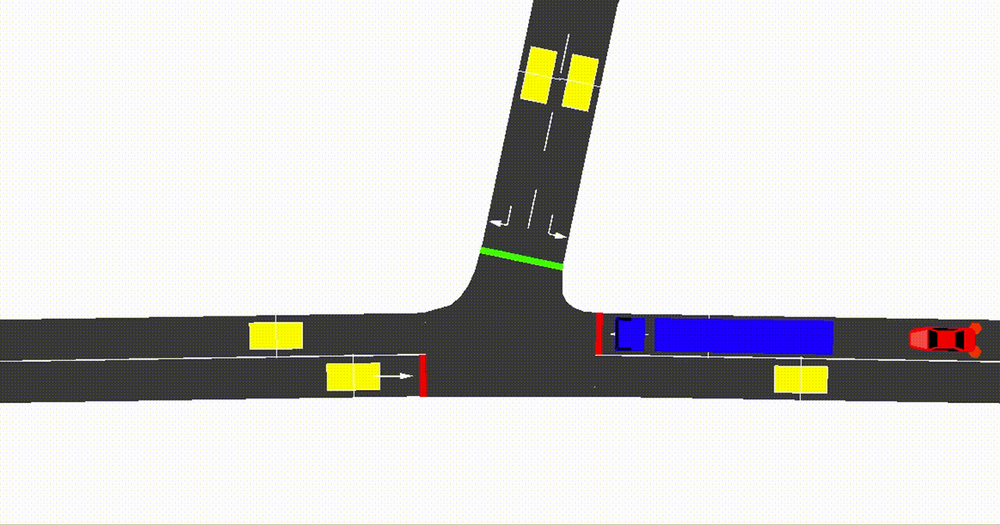
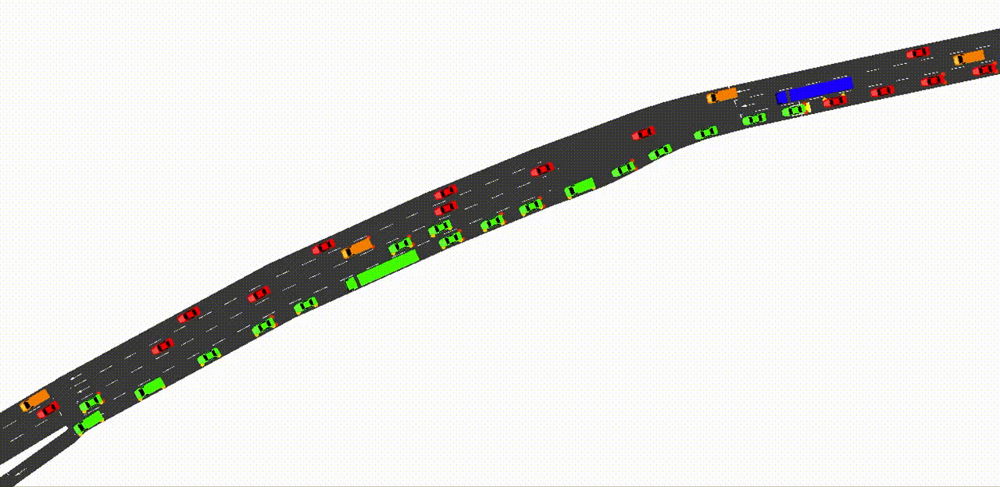

# Traffic Control

## Traffic Signal Control



!!! tip

    No initialisation is needed to perform dynamic traffic signal control, however, it is recommeded to create a [tracked junction](5_tracked_objs.md) to automatically collect data from the junction.
    
By default, all traffic signals will use the phases set in SUMO/netedit at the beginning of the simulation. TUD-SUMO is able to override these settings and update phases automatically, which is done using a `phase_dict` as shown below. A `phase_dict` can be included in the parameters file under '_phases_' when calling `Simulation.load_objects()`.

```python
phase_dict = {"traffic_signal_1":
                 {"phases": ["GGrr", "yyrr", "rrGG", "--yy"],
                  "times": [27, 3, 17, 3]
                 },
              "traffic_signal_2":
                 {"phases": ["GGrr", "yyrr", "rrGG", "--yy"],
                  "times": [20, 3, 34, 3]
                 }
             }
```

This dictionary uses two components:

  1. **Phases**:
    - This contains a list of phase strings, which represent the signal status during each phase. The phase strings must be the same length as the number of movements in SUMO.
    - Characters in the phase string can either '_r_' (red), '_y_' (yellow), '_g_' (green with no priority), '_G_' (green with priority) or '-' (do not change).
    - The index of each character refers to the setting for the corresponding movement, which are numbered clockwise starting at north (right turns &#8594; straight &#8594; left turns), with pedestrian crossings at the end.
  2. **Times**:
    - This contains the durations **in seconds** for each corresponding phase string.
    - Phase durations cannot be less than the simulation step length.

Once this has been created, the phases can be set using the `Simulation.set_phases()` function. `start_phase` can be used to start at different points in the phase cycle. `overwrite` determines whether to completely overwrite the phase dictionary for all signals or simply for specified signals.

```python
my_sim.set_phases(phase_dict, start_phase=0, overwrite=True)
```

Alternatively, it is possible to set a signal's phases indefinitely using `Simulation.set_tl_colour()`. The input can either be a regular phase string or a single character, meaning all movements are set this way. `Simulation.change_phase()` can be used to change to skip to a specific phase in the cycle.

```python
# Set "traffic_signal_1" permanently to all green
my_sim.set_tl_colour("traffic_signal_1", "G")

# Set "traffic_signal_2" permanently to "rrGG"
my_sim.set_tl_colour("traffic_signal_2", "rrGG")

# Skip "traffic_signal_3" to phase 3
my_sim.change_phase("traffic_signal_3", 2)
```

## Ramp Metering

Ramp metering is a motorway control measure where a traffic light is placed at an on-ramp in order to limit flow and avoid congestion. This help an engineer fully exploit the capacity of a motorway section next to an on-ramp without exceeding it. It is also an important method of reducing the impact of capacity drop, where the measured outflow from a bottleneck is significantly lower than the expected outflow. The most commonly used ramp metering algorithm in practice is Asservissement Linéaire d'entrée Autoroutiere (ALINEA).


!!! tip

    No initialisation is needed to perform ramp metering, however, it is recommeded to create a [tracked junction](5_tracked_objs.md) to automatically collect data from the meter.

Like a regular traffic signal, ramp meters will follow the phases defined within SUMO/netedit by default. Otherwise, initialising the ramp meter as a tracked junction will allow you to set an initial metering rate, which will start at the next simulation step.

```python
my_sim.add_tracked_junctions({"ramp_meter":
                                {'meter_params':
                                    {'min_rate': 200,  # Minimum allowed metering rate
                                    'max_rate': 2000,  # Maximum allowed metering rate
                                    'init_rate': 1800, # Initial metering rate
                                    'queue_detector': "ramp_queue"},
                                'flow_params':
                                    {'inflow_detectors': ["ramp_inflow", "ramp_upstream"],
                                    'outflow_detectors': ["ramp_downstream"]}
                                }
                            })
```

The ramp metering rate can then be set as below. Note that all metering rates are defined **in vehicles/hour**.

```python
my_sim.set_tl_metering_rate(rm_id="ramp_meter", metering_rate=1500)
```

Ramp meters use the exact same logic and `phase_dict` as traffic signals to operate, except the `Simulation.set_tl_metering_rate()` function calculates a phase setting that would result in the desired flow. This is primarily done by varying the red time. The settings can be changed using the parameters:

  - `g_time`: Green time, defaults to 1s for a one-car-per-green policy.
  - `y_time`: Yellow time, defaults to 1s.
  - `min_red`: Minimum red time. If the flow would require a red time less than this, the meter is set to green for the duration of the control interval.
  - `vehs_per_cycle`: The number of vehicles released with each cycle. The network will affect how many vehicles pass the meter with each green light, so the phase calculations can be changed to reflect this. By default, `vehs_per_cycle` is set to the number of lanes on the ramp.
  - `control_interval`: Control interval length in seconds. The cycle of the resulting phases will aim to loop seamlessly (where `control_interval % cycle_length == 0`), however, this may not be possible to achieve the desired metering rate.

If the junction is tracked, all ramp metering data will be stored under '_data/junctions/{meter_id}/meter_', and will contain '_metering_rates_', '_rate_times_', '_queue_lengths_', '_queue_delays_', '_min_rate_' and '_max_rate_'.

!!! warning

    Note that as ramp meters use the same logic as adaptive traffic signals, it is possible to accidentally overwrite their settings when using `Simulation.set_phases()`.

## Variable Speed Limits

Variable Speed Limits (VSL), also called dynamic speed limits, are a method of motorway traffic control where speed limits on road sections are dynamically changed based on conditions. A major advantage of this can be the increased safety, as VSL will often aim to lower and homogenise vehicle speeds, although it can also be used to limit congestion by 'holding back' vehicles and 'storing' them away from congested areas of a network. In practice, VSL is implemented through variable message signs on gantries above the motorway.

VSL can be simulated using a `VSLController` object. These can be added with the `Simulation.add_controllers()` function with their parameters in a dictionary as below. Multiple VSL and Dynamic Route Guidance (RG) controllers can be created in the same parameter dictionary. This can also be included under '_controllers_' when calling `Simulation.load_objects()`.

```python
vsl_parameters = {"vsl_controller":
                     {"type": "VSL",
                      "geometry_ids": ["edge_1", "edge_2", "edge_3"],
                      "default_limit": 80
                     }
                 }
my_sim.add_controllers(vsl_parameters)
```

Both '_type_' and '_geometry_ids_' are the only required parameters. '_type_' should be set to '_VSL_' to create a VSL controller, whilst '_geometry_ids_' is a list containing the IDs of edges under control. Note that controlled geometries can be either edges or lanes. '_default_limit_' is an optional parameter denoting the default speed limit.

A VSL controller can also be created by directly initialising the object with the same parameters dictionary, however, it must be added to the simulation to operate.

```python
from tud_sumo.controllers import VSLController

vsl_controller = VSLController(vsl_id="vsl_controller", vsl_params=vsl_parameters, simulation=my_sim)
my_sim.add_controllers({"vsl_controller": vsl_controller})
```

The controller will initialise as deactivated, meaning the controlled edges/lanes will use their default speed limits/maximum speed as defined in SUMO/netedit. However, it can be activated using the `VSLController.set_speed_limit()` function as below. This can either be used to activate the VSL with a new speed limit value, or to activate the VSL with the previously used speed limit or default value. Note that **the same speed limit is set for all controlled edges/lanes**.

The VSL controller can then be deactivated using the `VSLController.deactivate()` function. This will set all edges/lanes to their original speed limit as defined in SUMO/netedit.

```python
# Activate controller, setting speed limit to 60kmph
my_sim.controllers["vsl_controller"].set_speed_limit(60)

# Deactivate the control, set speed limits to no-control values
my_sim.controllers["vsl_controller"].deactivate()

# Reactivate controller, setting speed limit to last used value (60kmph)
my_sim.controllers["vsl_controller"].set_speed_limit()
```

```python
>>> my_sim.controllers["vsl_controller"].activated
True
```

VSL controllers will automatically register and save the changes in speed limit, and the times at which they occur. This data is stored in the `sim_data` dictionary under '_data/controllers/{vsl_id}/activation_times_'. This stores a series of tuples where the first value is the speed limit setting and the second value is the time step this setting was made. Speed limits of -1 denote the controller is being deactivated. Otherwise, the average speed on controlled edges/lanes throughout the simulation is also collected under '_data/controllers/{vsl_id}/geometry_data/{geometry_id}/avg_speeds_'.

VSL controller data can be reset using `VSLController.reset()`, or the controller itself can be removed using `Simulation.remove_controllers()`.

## Dynamic Route Guidance

Dynamic Route Guidance (RG) is a method of traffic management where vehicles are rerouted in order to avoid exceeding capacity on certain roads. This can be particularly useful in cases of non-recurrent congestion, such as during an accident, as drivers can be advised to avoid affected roads and given guidance on alternative routes. In practice, this is typically implemented for motorway traffic management with variable message signs above the road, although information can be transmitted directly to drivers with Vehicle-to-Infrastructure (V2I) technology.



RG can be simulated using a `VSLController` object. These can be added with the `Simulation.add_controllers()` function with their parameters in a dictionary as below. Multiple RG and Variable Speed Limit (VSL) controllers can be created in the same parameter dictionary. This can also be included under '_controllers_' when calling `Simulation.load_objects()`.

```python
rg_parameters = {"rg_controller":
                    {"type": "RG",
                     "detector_ids": ["induction_loop_1"],
                     "old_destination": "off_ramp_1",
                     "new_destination": "off_ramp_2",
                     "diversion_pct": 0.5,
                     "vehicle_type": ["cars", "lorries", "motorcycles", "vans"],
                     "highlight": "00FF00"
                    }
                }
my_sim.add_controllers(rg_parameters)
```

The only required parameters are '_type_' and '_detector_ids_'. '_type_' should be set to '_RG_' to create a RG controller, whilst '_detector_ids_' is a list containing the IDs of **induction loop** detectors that will act as the point where vehicles are redirected. All other parameters are optional and are detailed below.

  - '_old_destination_': Edge ID. If given, only vehicles with this as their destination will be redirected.
  - '_new_destination_': Edge ID. If given, this is used as the default new destination for redirected vehicles.
  - '_diversion_pct_': Float [0-1]. This acts as a probability of redirection for vehicles to simulate compliance. The default is 100%.
  - '_vehicle_type_': List of vehicle types for redirected vehicles.
  - '_highlight_': Hex code or list of rgba values. If given, redirected values are recoloured.

A RG controller can also be created by directly initialising the object with the same parameters dictionary, however, it must be added to the simulation to operate.

```python
from tud_sumo.controllers import RGController

rg_controller = RGController(vsl_id="rg_controller", rg_params=rg_parameters, simulation=my_sim)
my_sim.add_controllers({"rg_controller": rg_controller})
```

The controller will initialise as deactivated, meaning no vehicles are redirected, however, it can be activated using the `RGController.activate()` function. Similarly to VSL controllers, this can either be used to activate the RG with a new redirection target or '_new_destination_', or to activate the RG with the previously used target or default value. The diversion percent or highlight can also be changed.

```python
# Activate controller & redirect vehicles to 'off_ramp_2'
my_sim.controllers["vsl_controller"].activate("off_ramp_2")

# Deactivate the control & stop redirecting vehicles
my_sim.controllers["vsl_controller"].deactivate()

# Reactivate controller & redirect vehicles to 'off_ramp_3
my_sim.controllers["vsl_controller"].activate("off_ramp_3")
```

```python
>>> my_sim.controllers["rg_controller"].activated
True
```

RG controllers will automatically register and save changes, and the times at which they occur. This data is stored in the `sim_data` dictionary under '_data/controllers/{rg_id}/activation_times_'.

This stores a series of tuples where the first value is the new destination that vehicles are redirected towards, the second value is the diversion percent and the third is the time this change was made. A destination and diversion percent value of -1 denote the controller is being deactivated. Otherwise, the number of vehicles redirected throughout the simulation is also collected under '_data/controllers/{rg_id}/n_diverted_'.

New route objects can be created using [`Simulation.add_route()`](4_interactions.md#addingremoving-vehicles). Vehicles can then be redirected using the ID for the new route.

VSL controller data can be reset using `VSLController.reset()`, or the controller itself can be removed using `Simulation.remove_controllers()`.