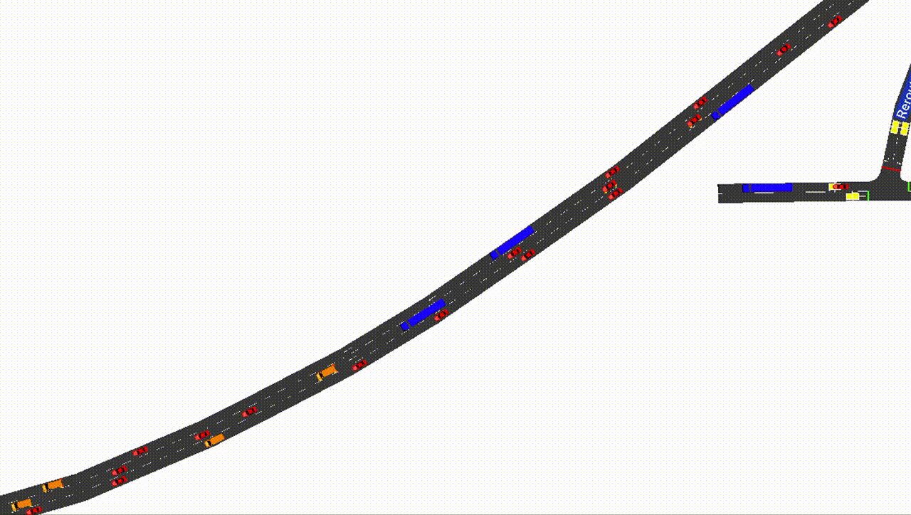

# Events

Events can be a useful part of designing a scenario, and can be used to simulate incidents, incident responses, or even different types of fixed control. TUD-SUMO includes the logic to schedule events and undo the changes made, for example, events can be used to reduce the speed limit of a road between specific times. Events designed to simulate incidents can also be created dynamically, with control over where the incident occurs and for how long. Events are also integrated into the plotting functions of TUD-SUMO, and can be displayed automatically on graphs if desired.



## Scheduled Events

Scheduled events are initialised through a event parameters dictionary, and added to the simulation through the `Simulation.add_events()` function as below. This dictionary can either be in code or as a '_.json_' or '_.pkl_' file, and can be included in the object parameters dictionary under '_events_' when calling `Simulation.load_objects()`. These are shown below.

All events require a '_start_time_'/'_start_step_' and '_end_time_'/'_end_step_' which represent when the event will occur, either in steps or simulation time. Otherwise, there are two types of effects that can be used; '_edges_' or '_vehicles_'.

  1. '_edges_':
    - Including edge effects will change edge states when the event is active. Both edges and lanes can be included.
    - Any variable defined in the [data keys](4_interactions.md#advanced-getters) for the `Simulation.set_edge_vals()` function can be used. The new edge/lane settings should be included under '_actions_' in the edge effects dictionary. The edge/lane IDs should be included under '_edge_ids_'.
    - When an event is first scheduled, the base values for all edges/lanes are stored. When the event occurs, all changes defined in the parameters dictionary are made. Once the event is over, all changes are undone.
  2. '_vehicles_':
    - Including vehicle effects will aim to change vehicle states whilst the effect is active, or changes can be made indefinitely.
    - Any variable defined in the [data keys](4_interactions.md#advanced-getters) for the `Simulation.set_vehicle_vals()` function can be used. The new vehicle settings should be included under '_actions_' in the vehicle effects dictionary.
    - Vehicles can either be affected based on a list of vehicle IDs or based on location If '_vehicle_ids_', only the specified vehicles will be affected. If '_location_' is given, affected vehicles are randomly chosen based on where they are in the network. The locations list can, therefore, include edge IDs, lane IDs or detector IDs, meaning that vehicles that pass over a specific edge/lane/detector can be controlled during an event. It is required to provide either a '_vehicle_ids_' or '_location_' list.
    - If vehicles are being chosen randomly based on location, there are three other parameters that can be used; '_vehicle_limit_', '_effect_probability_' and '_effect_duration_'. If a '_vehicle_limit_' is given, new vehicles will no longer be effected once this threshold has been reached. If an '_effect_probability_' is given, new vehicles will only be affected based on this probability. If '_effect_duration_' is given, vehicles will only be affected for a certain amount of steps, otherwise, they are permanently affected.
    - The '_highlight_' parameter can be used to colour affected vehicles in the GUI.
    - If '_remove_affected_vehicles_' is given and when set to `True`, affected vehicles are removed from the simulation once the effect is over.
    - Both '_speed_safety_checks_' and '_lc_safety_checks_' are boolean parameters that can be used to disable vehicle safety checks when changing lanes or speed. This may be useful when directing vehicles to make unsafe movements as these checks are enabled in SUMO by default.

!!! tip

    Both vehicle and edge/lane effects can be used during the same scheduled event.

An example of a scheduled event with edge effects is shown below. Here, '_lane_1_' and '_lane_2_' are closed to all vehicles between 200-400s.

```python
bn_parameters = {"bottleneck": 
                    {"start_time": 200,
                     "end_time": 450,
                     "edges":
                         {"edge_ids": ["lane_1", "lane_2"]
                          "actions":
                              {"disallowed": ["passenger","trailer","motorcycle","delivery"]},
                         }
                    }
                }
```

!!! warning

    When suddenly closing edges or lanes like this, vehicles may get trapped until permissions are changed back. This is expected as closing lanes also closes outgoing connections from the lane, meaning that vehicles cannot leave.

An example of a scheduled event with vehicle effects is shown below with a possible reaction to the bottleneck. Here, vehicles on nearby edges '_edge_1_', '_edge_2_' and '_edge_3_' have their maximum speed changed to 40kmph for 100s, with 100% probability. These affected vehicles are coloured red.

```python
rp_parameters = {"bottleneck_reaction":
                    {"start_time": 210,
                     "end_time": 500,
                     "vehicles":
                        {"locations": ["edge_1", "edge_2", "edge_3"],
                         "actions": {"max_speed": 40}
                         "effect_duration": 100,
                         "effect_probability": 1,
                         "remove_vehicles": False,
                         "speed_safety_checks": False,
                         "lc_safety_checks": False,
                         "highlight": "#FF0000"
                        }
                    }
                }
```

Event parameters are stored in the `sim_data` dictionary under '_data/events/{status}/{event_id}_'. The status can either be '_scheduled_', '_active_' or '_completed_'.

## Dynamic Incidents

Incidents on the network can be dynamically simulated using the `Simulation.cause_incident()` function. This creates an event that starts in the next simulation step, where a set of vehicles stop in the road for a set duration. After the incident, these vehicles are removed. Dynamically causing incidents may be useful when training or evaluating incident-responsive traffic management systems.

The only required parameter is `duration`, denoting the duration of the incident in steps. Otherwise, the vehicles chosen can be either specified by the user or completely random. Below is an example of an incident lasting 100s that involves two specific vehicles, '_car_1_', '_lorry_1_'. By default, the edges that the vehicles are on have their speed limits reduced to 15kmph (or 10mph) to simulate vehicles driving cautiously around the incident. This can be disabled by setting `edge_speed` to `None`.

```python
my_sim.cause_incident(duration=100, vehicle_ids=["car_1", "lorry_1"])
```

For random incidents, it is still required to set the location through the `geometry_ids` parameter. This can be a list of edge/lane IDs or single ID. Vehicles in this location(s) are then randomly selected to be involved in the incident. `n_vehicles` denotes how many vehicles should be included. `vehicle_separation` is a float [0-1] that denotes how far apart the randomly selected vehicles should be, with 0 being close. Note that if there not enough vehicles on the selected edges, the surrounding edges are searched, meaning the incident may spread across many distant edges with high `vehicle_separation`. `highlight_vehicles` is a boolean that denotes whether to highlight involved vehicles with a circle around them.

!!! warning

    With a high `n_vehicles` value, the algorithm may not be able to find enough vehicles, particularly with a high `vehicle_separation`. If `assert_n_vehicles` is set to `True`, an error will be thrown when this is the case, otherwise, the simulation will continue and `cause_incidents()` will return `False`.

Below is an example of a dynamic incident. Here, 4 cars on edges '_edge_1_' and '_edge_2_' are stopped on the road for 100s, whilst the edges have their speed reduced to 20kmph. Each incident is added to the simulation as an event, meaning it will show in saved data and on plots as an event. By default, the incident will be defined a unique ID '_incident\_[x]_', however, an ID can be assigned manually as below.

```python
success = my_sim.cause_incident(duration=100,
                                geometry_ids=["edge_1", "edge_2"],
                                n_vehicles=4,
                                vehicle_separation=0,
                                assert_n_vehicles=False,
                                edge_speed=20,
                                highlight_vehicles=True,
                                incident_id="pileup"
                               )
```

!!! Warning

    At the end of the incident, the vehicles are removed from the simulation which causes a SUMO error to be printed to the console, an example of which is shown below. This has no impacts on the simulation and can be safely ignored. 

    ```
    Error: Answered with error to command 0xa4: Vehicle 'vehicle_0' is not known.
    Error! Vehicle 'vehicle_0' is not known.
    ```