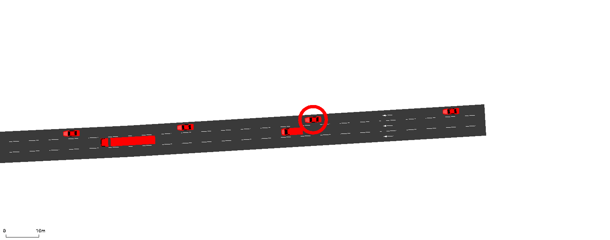
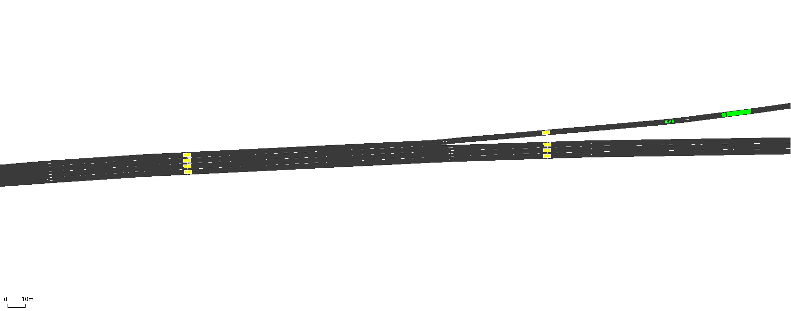
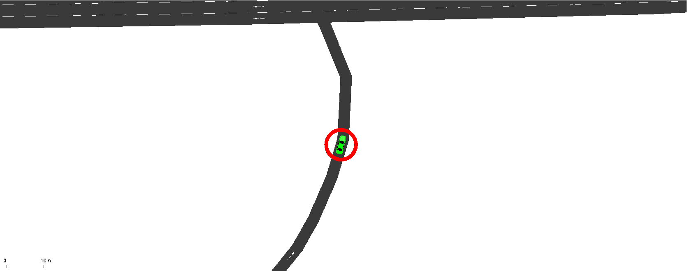

# GUI & Videos

## GUI Functions

Several functions are provided specifically for controlling the Graphical User Interface (GUI). More general information on using the SUMO GUI can be found at [sumo.dlr.de/docs/sumo-gui.html](https://sumo.dlr.de/docs/sumo-gui.html). In order to run a simulation with the GUI active using TUD-SUMO, use:

```python
from tud_sumo.simulation import Simulation

my_sim = Simulation(scenario_name="example", scenario_desc="Example simulation.")
my_sim.start("example_scenario.sumocfg", gui=True)
```

The 4 functions used for interacting with the SUMO GUI are listed below. The GUI itself can have multiple different views, or windows, but the default/main view is called '_View #0_'.

  - `set_view()`:
    - Sets a view's bounds and/or zoom level.
    - Bounds use a tuple of two coordinates to define the new view, as in (lower-left point, upper-right point).
    - The zoom level is defined in percent.<br><br>
  - `take_screenshot()`:
    - Takes a screenshot of a view in the next time step and saves the result to a file.
    - If the bounds and/or zoom is not specified, the current view is used.<br><br>
  - `gui_track_vehicle()`:
    - Sets a view to follow a vehicle through the network, either until it leaves the network or the tracking is manually stopped.
    - The vehicle is tracked by its ID, and can be highlighted if `highlight` is set to `True`.
    - By default, the main/default view is used. An example of vehicle tracking is shown below.<br><br>
  - `gui_stop_tracking()`:
    - Stops a view from tracking a vehicle.<br><br>



```python
# Define view by its ID
default_view = "View #0"

while my_sim.curr_step < 500:

    my_sim.step_through()

    if my_sim.curr_step == 100:
        # Set the view boundaries to (min_x: 0, max_x: 200, min_y: 0, max_y: 200) and zoom to 500%
        my_sim.set_view(view_id=default_view, bounds=((0, 0), (200, 200)), zoom=500)

        # Take a screenshot of the current view settings and save it to "images/screenshot.png"
        my_sim.take_screenshot(view_id=default_view, "images/screenshot.png")

    if my_sim.curr_step == 200:
        # Set the default view to follow "car_0" as it travels through the network
        my_sim.gui_track_vehicle(vehicle_id="car_0", view_id=default_view)

    if my_sim.curr_step == 300:
        # Set the default view to stop following "car_0"
        my_sim.gui_stop_tracking(view_id=default_view)
```

## Recording Videos

The `Recorder` class can be used to record videos of the GUI through 2 functions; `Recorder.record_network()` and `Recorder.record_vehicle()`. Videos are then saved using `Recorder.save_recording()`. The GUI must be active to record videos.

```python
from tud_sumo.videos import Recorder
from tud_sumo.simulation import Simulation

my_sim = Simulation(scenario_name="example", scenario_desc="Example simulation.")
my_sim.start("example_scenario.sumocfg", gui=True)

recorder = Recorder(my_sim)
```

Recordings are defined by a unique recording name, which allows for multiple recordings to be made at the same time on different views. Videos are made by taking screenshots at each time step, which can then be joined together to create the final video. The frames are saved to a file called `{recording_name}_frames`, although this can be changed using the `frames_loc` parameter. The file is always created when the video is started, and is deleted by default, along with the individual frames, once the recording is over.

Multiple recordings can be done simultaneously, although they should begin at the same time as each requires a new view to be created. Adding new views changes the aspect ratio of already existing views, which stops the final video from being created.

To record a static recording of a specific part of the network, use `Recorder.record_network()`. This is based on a `bounds` and `zoom` parameter, as shown below. `speed` can also be changed. By default, videos are real-time when `speed = 1`, although increasing this value acts as a multiplier on the FPS (`FPS = speed / step_length`).

```python
recording_name = "network_test"

while my_sim.curr_step < 500:

    my_sim.step_through()

    if my_sim.curr_step == 100:
        # At t=100, start recording a video with boundaries (min_x: 0, max_x: 200,
        # min_y: 0, max_y: 200) and zoom 500%. The frames will be saved to a directory
        # named 'frames' instead of the default 'network_test_frames'
        recorder.record_network(recording_name = recording_name
                                bounds = ((0, 0), (200, 200)), 
                                zoom = 500,
                                speed = 16,
                                frames_loc = "frames"
                               )
```

To finish the recording and save the final video, use `Recorder.save_recording()` as below. This will delete the frame files and save the video. By default, the video is called `{recording_name}.mp4`. Videos can currently only be created in an '_.mp4_' format and must be at least 3 time steps long. 

```python
    if my_sim.curr_step == 300:
        recorder.save_recording(recording_name, video_filename="video.mp4")
```



Alternatively, to record a vehicle as it travels through the network, use `Recorder.record_vehicle()` as below. By default, the recording will finish once the vehicle leaves the network, although it can be ended early using `Recorder.save_recording()`.

```python
recording_name = "vehicle_test"

while my_sim.curr_step < 500:

    my_sim.step_through()

    if my_sim.curr_step == 100:
        # At t=100, start recording a video of "car_0", with zoom 1200%. The
        # frames will be saved to a directory named 'frames' instead of the
        # default 'vehicle_test_frames'
        recorder.record_vehicle(recording_name = recording_name
                                vehicle_id = "car_0", 
                                zoom = 1200,
                                speed = 20,
                                frames_loc = "frames"
                               )

```

