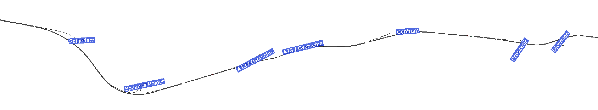

A more complex example of TUD-SUMO with multiple controllers and object tracking can be downloaded at [github.com/tud-sumo/example](https://github.com/tud-sumo/example), which includes a pre-made scenario of the A20 in Rotterdam, the Netherlands.

This example is also shown below.

```python

```