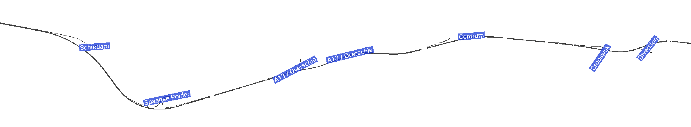

## Basic Scenario


Below is a basic example that can be used to check that SUMO and TUD-SUMO are installed and run correctly. The network used is shown above, and is a simple ~300m stretch of road with a constant demand of 1800veh/hr.

This example can be downloaded from the `basic_example` file at: [github.com/tud-sumo/example](https://github.com/tud-sumo/example)

```python
from tud_sumo.simulation import Simulation

if __name__ == "__main__":

    # Initialise the simulation object.
    my_sim = Simulation(scenario_name="basic_scenario",
                        scenario_desc="TUD-SUMO integrity check.")

    # Start the simulation, defining the sumo config files.
    my_sim.start("basic_scenario/sumo_config.sumocfg",
                 gui=True,
                 seed=1)
    
    # Run through the simulation for 1000 steps.
    my_sim.step_through(n_steps=1000)

    # End the simulation.
    my_sim.end()

    # Save the simulation data & print a summary, which is also saved.
    my_sim.save_data("example_data.json")
    my_sim.print_summary(save_file="example_summary.txt")
    
```

## A20 Scenario




Below, the northern section of the motorway ringroad around Rotterdam, the A20 between Schiedam and the Kralingse Bos, is simulated. This scenario aims to demonstrate the full functionality of TUD-SUMO, with multiple ramp meters, variable speed limit and route guidance controllers, as well as several different events and interactions. The layout of the network itself is shown above.

This example can be downloaded from the `a20_example` file at: [github.com/tud-sumo/example](https://github.com/tud-sumo/example)

```python

```