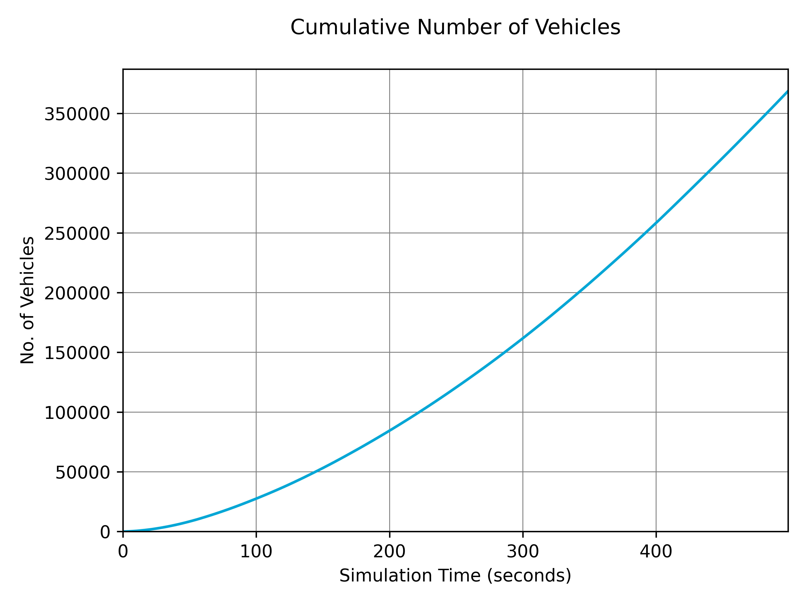
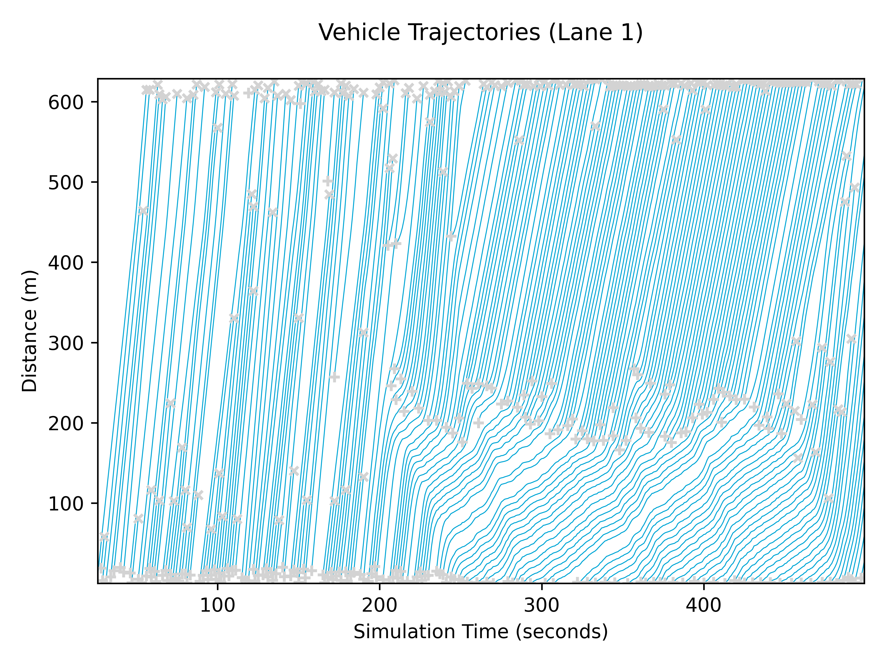
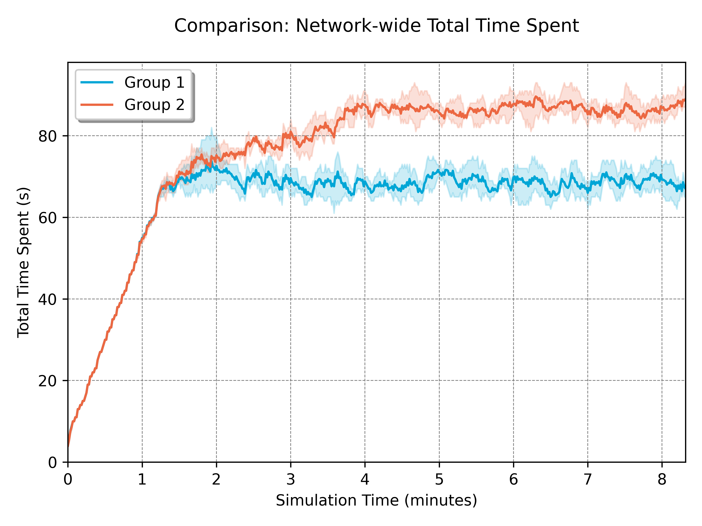
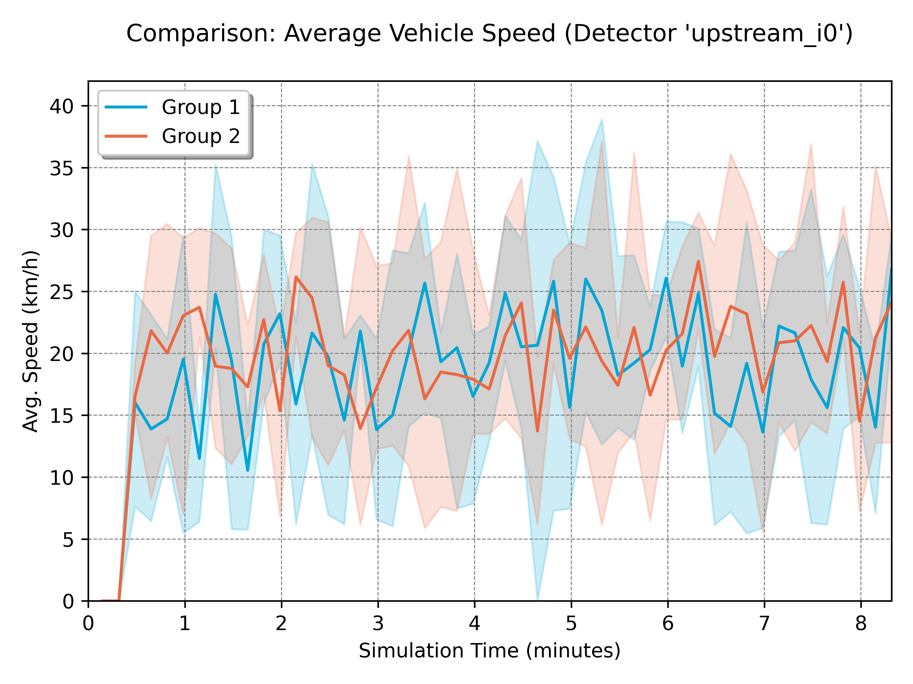
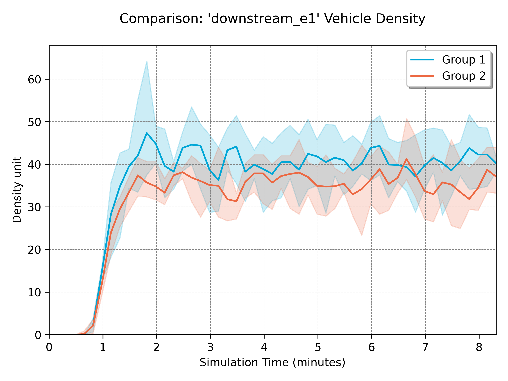
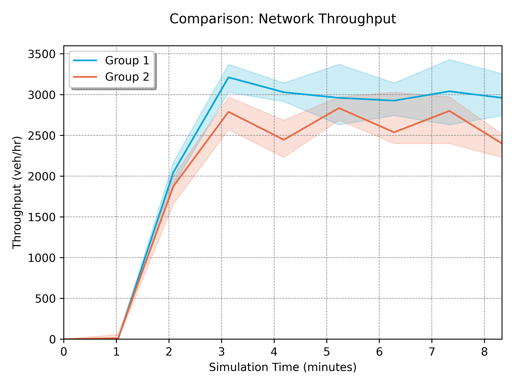
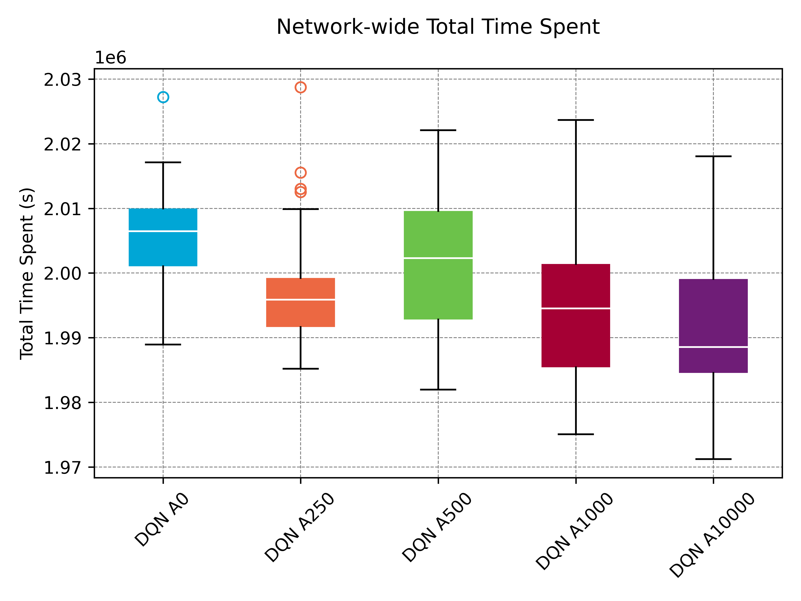
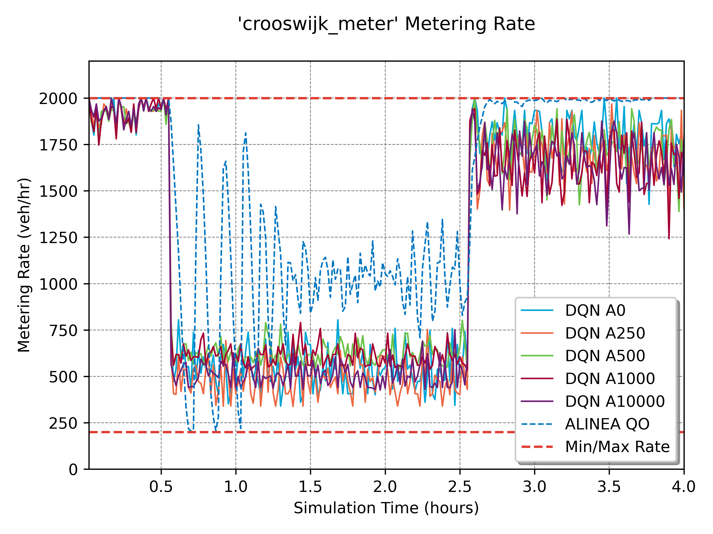

# Plotting Data

TUD-SUMO aims to provide plotting functions with each feature. These are specifically tailored to the data collected in the `sim_data` and have a unified and standardised form. It has also been designed to facilitate plotting a large number of graphs, and graphs for different scenarios. All graphs for a specific simulation can, therefore, be saved with the same label and in specific locations.

Two classes are provided for plotting simulation data, `Plotter` and `MultiPlotter`. `Plotter` is used for plotting data from one simulation, whilst `MultiPlotter` is used to plot data from multiple simulations. The two classes share much of the same usage, but differ in their initialisation. These shared settings and the classes themselves are explained below.

## Shared Settings

### Common Parameters

Whenever possible, all plotting functions (for `Plotter` and `MultiPlotter`) include `time_range` and `show_events` parameters. By default, graphs are plotted for the data throughout the whole simulation. `time_range` can be used to plot a specific duration within the simulation, and is defined in **in plotter time units**, ie. hours or minutes. `show_events` can either be a single event ID, list of event IDs or an event status ('_scheduled_', '_active_' or '_completed_'), which will plot all events with this status. To plot all events, set `show_events = "all"`. By default, no events are plotted.

Usage examples of `time_range` and `show_events`, as well as the resulting plots are shown below.

```python
plt = Plotter("example_data.pkl", time_unit="minutes")

# Figure 1
plt.plot_cumulative_curve()

# Figure 2
plt.plot_cumulative_curve(time_range=[3, 6])

# Figure 3
plt.plot_cumulative_curve(time_range=[3, 6], show_events="bottleneck")
```


### Colours

Certain functions use a `plt_colour` parameter that can be used to set the line colour when plotting graphs. All matplotlib colours are valid parameters. By default, TUD-SUMO uses the [TU Delft colour palette](https://www.tudelft.nl/huisstijl/bouwstenen/kleur) as below, and so these colours are also valid parameters.


### Display & Saving Graphs

All graphs can be saved or shown onscreen with the `save_fig` parameter. If a valid filename is given, the resulting plot is saved, otherwise, it is shown onscreen. An example is shown below.

```python
# Display trajectories graph
plt.plot_trajectories(["edge_1", "edge_2", "edge_3"])

# Save trajectories graph to 'figs/trajectories.png'
plt.plot_trajectories(["edge_1", "edge_2", "edge_3"], save_fig="figs/trajectories.png")
```

## Plotter Class

The `Plotter` class is initialised with a **single** corresponding active `Simulation` object or data file from previous runs. This is the only required parameter, although the other settings are:

  - `sim_label`: Adds a string as a label to the title of all plots.
  - `time_unit`: Sets the time scale used for all plots, either '_steps_', '_s_' (seconds), '_m_' (minutes) or '_hr_' (hours).
  - `save_fig_loc`: Sets the location for all saved figures.
  - `save_fig_dpi`: Resolution for saved figures.
  - `overwrite_figs`: Denotes whether to overwrite old figures when saving.

```python
from tud_sumo.plot import Plotter

# Simple initialisation
plt = Plotter(my_sim)

plt = Plotter(simulation="example_data.json",
              sim_label="Example",
              time_unit="hr",
              save_fig_loc="figs/",
              save_fig_dpi=400,
              overwrite_figs=False
             )
```

### Plotting Functions

!!! Warning

    Please note that some functions will require objects to be created or tracked.

All (current) plotting functions are listed in the table below. Several graph examples are shown beneath the table.

| Function                       | Plot                                                                                                               |
|--------------------------------|--------------------------------------------------------------------------------------------------------------------|
| `plot_vehicle_data()`          | Network-wide vehicle data such as the number of vehicles, number of waiting vehicles, Total Waiting Time (TWT), Total Time Spent (TTS) or delay. |
| `plot_detector_data()`         | Detector specific data, either speeds, vehicle counts or occupancies.                                              |
| `plot_edge_data()`             | Tracked edge data, either flows, speeds, densities, vehicle counts or occupancies.                                 |
| `plot_junc_flows()`            | Either junction inflow & outflow, or number of vehicles in an intersection.                                        |
| `plot_tl_colours()`            | Traffic light signal settings over time.                                                                           |
| `plot_od_demand()`             | Flow rate, either for a route or an OD pair. Note, this only includes data added in TUD-SUMO.                      |
| `plot_od_trip_times()`         | Average trip times for OD pairs.                                                                                   |
| `plot_trip_time_histogram()`   | Trip time distribution as a histogram.                                                                             |
| `plot_throughput()`            | Rate of completed trips in vehicles per hour.                                                                      |
| `plot_cumulative_curve()`      | Cumulative curve, either for network-wide data or for specific inflow and outflow detectors.                       |
| `plot_space_time_diagram()`    | Space-time diagram based on `step_vehicles` data in tracked edges.                                                 |
| `plot_trajectories()`          | Trajectories based on `step_vehicles` data in tracked edges. Use `lane_idx` to plot lane-specific data.            |
| `plot_fundamental_diagram()`   | Fundamental diagram based on tracked edge data.                                                                    |
| `plot_rm_rate()`               | Metering rate for a ramp metering controller.                                                                      |
| `plot_rm_queuing()`            | On-ramp queue length/spillback for a ramp meter, if tracked.                                                       |
| `plot_rm_rate_queuing()`       | Metering rate and queue length/spillback for a ramp meter, if tracking queuing.                                    |
| `plot_rm_rate_detector_data()` | Metering rate and corresponding detector data.                                                                     |
| `plot_vsl_data()`              | Variable speed limit controller settings and average speeds on controlled edges.                                   |
| `plot_rg_data()`               | Number of vehicles diverted by a route guidance controller.                                                        |

### Example Graphs

1. `plt.plot_vehicle_data(data_key"no_vehicles", plot_cumulative=True, show_events=False, save_fig="n_vehicles.png")` 

2. `plt.plot_junc_flows(junc_id="utsc", show_events=False, save_fig="junc_flows.png")` 

3. `plt.plot_tl_colours(junc_id="utsc", save_fig="tl_colours.png")` 

4. `plt.plot_cumulative_curve(show_events=False, save_fig="cumulative_curve.png")` 

5. `plt.plot_trajectories(["126730026", "1191885773", "1191885771", "126730171", "1191885772", "948542172", "70944365", "308977078", "1192621075"], lane_idx=0, save_fig="trajectories.png", show_events=False)` 

6. `plt.plot_rm_rate(rm_id="crooswijk_meter", show_events=False, save_fig="rm_rate.png")` 

7. `plt.plot_vsl_data(vsl_id="vsl", show_events=False, save_fig="vsl_data.png")` 

## MultiPlotter Class

The `MultiPlotter` class can be used to plot the data from multiple simulations on the same graph. During initialisation, its parameters are:

  - `scenario_label`: Adds a string as a label to the title of all plots.
  - `units`: Simulation data units, either '_metric_', '_imperial_' or '_uk_'. This must match all added simulations.
  - `time_unit`: Sets the time scale used for all plots, either '_steps_', '_s_' (seconds), '_m_' (minutes) or '_hr_' (hours).
  - `sim_data_loc`: Sets the location for all simulation datasets.
  - `save_fig_loc`: Sets the location for all saved figures.
  - `save_fig_dpi`: Resolution for saved figures.
  - `overwrite_figs`: Denotes whether to overwrite old figures when saving.

Once the `MultiPlotter` object has been created, simulation datasets are added using the `MultiPlotter.add_simulations()` function. After this, all added datasets are plotted on all graphs. Datasets can either be plotted individually or in groups, where graphs will show the minimum, maximum and average values. Note that datasets can only be added through a previously saved `sim_data` file, and cannot be an active simulation as with `Plotter`.

There are four parameters for `MultiPlotter.add_simulations()`:

  - `simulations`: A list of filenames of `sim_data` files. This can also be a single filename.
  - `labels`: A list of labels for each simulation, which must have the same length as `simulations`. If `labels` is not given, datasets use their scenario name as the label.
  - `groups`: A list of group names, or a single group. If a list is given, the list must have the same length as `simulation` and datasets are assigned groups element-wise. If a single group ID is given, all datasets listed in `simulations` are included in this group.
  - `pbar`: A boolean denoting whether to show a progress bar when loading datasets.

!!! warning
    All simulation datasets must have the same **_start time, end time, step length and unit_**. It is assumed all datasets correspond to the **_same scenario_**.

An example usage of this is shown below:

```python
from tud_sumo.plot import MultiPlotter

mplt = MultiPlotter(scenario_label="RL Models", # Add 'RL Models' as a label to all graphs
                    sim_data_loc="data/",       # All sim_data files are loaded from 'data/'
                    save_fig_loc="figs/",       # All graphs will be saved in 'figs/'
                    time_unit="hours")          # Use 'hours' as the unit for all graphs

# Add a single no-control simulation dataset
# 'no_control.pkl' will be plotted individually
mplt.add_simulations("no_control.pkl")

# Add 3 simulation datasets, all in the 'baseline' group
# These datasets will be plotted together, with the minimum/maximum and average values
mplt.add_simulations(["baseline1.pkl", "baseline2.pkl", "baseline3.pkl"], groups="baseline")

# Add 3 simulation datasets, defining a label for each
# No groups are assigned, so all datasets will be plotted individually
mplt.add_simulations(["model1.pkl", "model2.pkl", "model3.pkl"], labels=["Model 1", "Model 2", "Model 3"])

# Add 4 simulation datasets, split into two groups
# 'model4a/b.pkl' and 'model5a/b.pkl' will both be grouped together
mplt.add_simulations(["model4a.pkl", "model4b.pkl", "model5a.pkl", "model5b.pkl"],
                     groups=["Model 4", "Model 4", "Model 5", "Model 5"])
```

### Plotting Functions

The available functions in the `MultiPlotter` class are listed below. All functions use 2 extra parameters than in the `Plotter` class; `plot_groups` and `plot_range`. `plot_groups` allows for only specific groups to be plotted by passing a list of dataset group IDs. By default, all groups are plotted. `plot_range` denotes whether to plot the shaded region between minimum and maximum values of groups on certain graphs.

1. `mplt.plot_vehicle_data("tts")` 
2. `mplt.plot_detector_data("upstream_i0", "speeds", aggregation_steps=10)` 
3. `mplt.plot_edge_data("downstream_e1", "densities", aggregation_steps=10)` 
4. `mplt.plot_throughput()` 
5. `mplt.plot_statistics("tts")` 
6. `mplt.plot_rm_rate("ramp_meter_id")` 