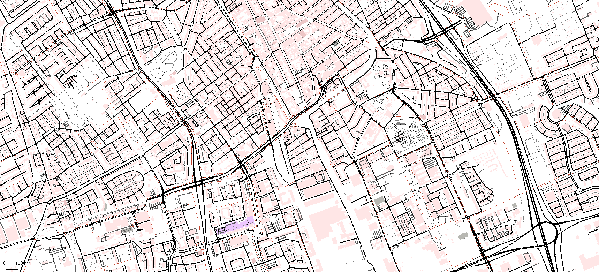

# Welcome to the TUD-SUMO Wiki!

  
  
  

  
  

This is the documentation for the TUD-SUMO package, a research-oriented wrapper for SUMO[1], developed for the DAIMoND lab at the Technische Universiteit Delft (TUD), the Netherlands. 

The main goal of TUD-SUMO is to act as a simplified framework for microscopic traffic simulation that allows researchers and students to focus on the important aspects of their projects; **their own work**, instead of simulation code. TUD-SUMO provides an easy and standardised way to simulate a wide range of scenarios whilst facilitating complex interactions. Resulting data can then be saved, summarised and visualised with minimal code.

More information on "Simulation of Urban MObility" (SUMO) can be found in the SUMO documentation, here: [sumo.dlr.de/docs/](https://sumo.dlr.de/docs/)

The main features of TUD-SUMO include:

  - Automatic and standardised data collection.
  - Simplified interface to interact with and control the simulation in complex ways.
  - Traffic signal control logic.
  - Extendable controllers already implemented (ramp metering, route guidance and variable speed limits).
  - A weather & event system with dynamic or scheduled incidents.
  - Plotting functions for a wide range of applications.
  - Videos for recording the network or specific vehicles during the simulation.
  - And _more in the future! ..._

## Links

1. Simulation of Urban MObility (SUMO) documentation: [sumo.dlr.de/docs](https://sumo.dlr.de/docs/)
2. TUD-SUMO source code (GitHub): [DAIMoNDLab/tud-sumo](https://github.com/DAIMoNDLab/tud-sumo)
3. TUD-SUMO PyPI distribution: [project/tud-sumo](https://pypi.org/project/tud-sumo/)
4. TUD-SUMO example (GitHub): [DAIMoNDLab/tud-sumo-examples](https://github.com/DAIMoNDLab/tud-sumo-examples)

## Latest Version

The Latest version of TUD-SUMO is _v3.3.0_, and was released on 01/10/2025. All previous versions and their change notes can be found on [GitHub](https://github.com/DAIMoNDLab/tud-sumo/releases) or [PyPI](https://pypi.org/project/tud-sumo/#history). This documentation was last updated on {{ git.date.strftime("%d/%m/%Y") }}.

The most recent change notes are:

### Weather & Events Update

#### Additions
- Added `Simulation.add_weather()` to simulate weather effects using the event system.
- Added `Simulation.[stop|resume]_vehicle()`.
- Added `Simulation.[get|remove]_events()` to get and remove events from the simulation.
- Added `Event.terminate()` to end active events early.
- Added `EventScheduler.[get|remove]_event()` function.
- Added `"next_edge_id"` to `Simulation.get_vehicle_vals()` to return next edge in a vehicle's route.
- Added `"stop"` to `Simulation.set_vehicle_vals()` to stop a vehicle randomly along its next edge.
- Added desired time headway (tau), imperfection (sigma) and speed factor to `Simulation.[get|set]_vehicle_vals()`.
- Added imperfection to `Simulation.[get|set]_vehicle_type_vals()` and `DemandProfile.add_vehicle_type()`.
- Added `max_[ac|de]celeration` in vehicle (type) getters/setters, as distinct from current `acceleration`.
- Added last step flow, density, delay and TTS to geometry data.
- Added option to include insertion delay in network-wide delay calculations.

#### Changes
- Weather events can now be displayed on plots in green.
- Added `”r_effects”`, `”location_only”` and `”force_end”` options to events to apply relative effects, ensure effects are only active in the specified location and immediately remove any effects at the end of the event, respectively.
- Event vehicle effects no longer require a set of actions.
- Incident duration is now in seconds, not steps.
- Updated ramp metering delay calculation.
- Removed requirement for edge or vehicle actions in events.
- Changed matplotlib stylesheet from default to 'seaborn-v0_8-whitegrid'.
- Updated function definition formatting.

#### Bug Fixes
- Fixed `Simulation.cause_incidents()`,  where vehicles would still move. Vehicles now stop on the next edge in their route.
- Fixed geometry average vehicle speed calculation (changed to use vehicle speeds instead of TraCI calls due to inconsistent values).
- Fixed changing vehicle type maximum lateral speed using wrong function.
- Fixed error in `Simulation._get_all_vehicle_data()` when vehicles pass over multiple internal lanes consecutively.
- Fixed `KeyError` in `DemandProfile.add_vehicle_type()`.
- Fixed event effect probability by permanently ignoring unaffected vehicles.
- Fixed syntax error in error handling within `utils.test_input_dict()`.
- Fixed string formatting error.
- Fixed `random.choices()` argument error.
- Fixed attribute error in `Plotter.plot_tl_colours()`.

## Contact

TUD-SUMO is developed in the DAIMoND lab of TU Delft. For any questions or feedback, please contact Callum Evans at _c.evans@tudelft.nl_. Bug reports can be created in the GitHub repository: [github.com/DAIMoNDLab/tud-sumo](https://github.com/DAIMoNDLab/tud-sumo/).

## Acknowledgements

TUD-SUMO is part of the research under the project "_AI in Network Management_," funded by Rijkswaterstaat, grant agreement nr. 31179439, under the label of ITS Edulab.

## Citations

  1. "_Microscopic Traffic Simulation using SUMO_"; Pablo Alvarez Lopez, Michael Behrisch, Laura Bieker-Walz, Jakob Erdmann, Yun-Pang Flötteröd, Robert Hilbrich, Leonhard Lücken, Johannes Rummel, Peter Wagner, and Evamarie Wießner. _IEEE Intelligent Transportation Systems Conference (ITSC)_, 2018.