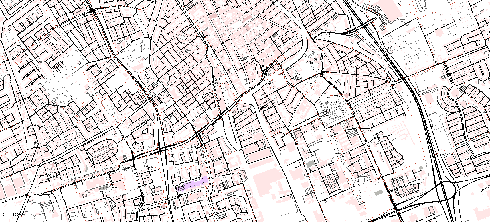

# Welcome to the TUD-SUMO Wiki!

  
  
  
   
  
  

  

This is the documentation for the TUD-SUMO package, a research-oriented wrapper for SUMO[1], developed for the DAIMoND lab at the Technische Universiteit Delft (TUD), the Netherlands. 

The main goal of TUD-SUMO is to act as a simplified framework for microscopic traffic simulation that allows researchers and students to focus on the important aspects of their projects; **their own work**, instead of simulation code. TUD-SUMO provides an easy and standardised way to simulate a wide range of scenarios whilst facilitating complex interactions. Resulting data can then be saved, summarised and visualised with minimal code.

More information on "Simulation of Urban MObility" (SUMO) can be found in the SUMO documentation, here: [sumo.dlr.de/docs/](https://sumo.dlr.de/docs/)

The main features of TUD-SUMO include:

  - Automatic and standardised data collection.
  - Simplified interface to interact with and control the simulation in complex ways.
  - Traffic signal control logic.
  - Extendable controllers already implemented (ramp metering, route guidance and variable speed limits).
  - An event system with dynamic or scheduled incidents.
  - Plotting functions for a wide range of applications.
  - And _more in the future! ..._

## Links

1. Simulation of Urban MObility (SUMO) documentation: [sumo.dlr.de/docs/](https://sumo.dlr.de/docs/)
2. TUD-SUMO source code: [github.com/tud-sumo/tud_sumo](https://github.com/tud-sumo/tud_sumo/)
3. TUD-SUMO PyPI distribution: [pypi.org/project/tud-sumo/](https://pypi.org/project/tud-sumo/)
4. TUD-SUMO example: [github.com/tud-sumo/example](https://github.com/tud-sumo/example)

## Latest Version

The Latest version of TUD-SUMO is _v3.0.12_, and was released on 10/09/2024. All previous versions and their change notes can be found on [GitHub](https://github.com/tud-sumo/tud_sumo/releases) or [PyPI](https://pypi.org/project/tud-sumo/#history). This documentation was last updated on {{ git.date.strftime("%d/%m/%Y") }}.

The change notes for the latest version are:

### Saving Object Parameters & Vehicle In/Out Function Improvements

#### Additions & Improvements

  - Added `Simulation.save_objects()` to save object initialisation parameters.
  - Added routes to object parameters in `Simulation.[save/load]_objects()`.
  - Added `"simulation"` as a valid parameter in vehicle in/out functions, which will pass in the simulation object itself.
  - Added ability to use extra (non-simulation) parameters in vehicle in/out functions. These are set when the function is added and can be updated using `Simulation.update_vehicle_function_parameters()`.
  - Added `gui_file` to `Simulation.start()`.
  - Added more comments to the `Simulation` class.

#### Bug Fixes

  - Fixed error in `Plotter.plot_junc_flows()` when plotting with active simulations.
  - Fixed time range not working correctly in `Plotter.plot_tl_colours()`.
  - Removed invalid edges/lanes from their respective lists.
  - Corrected default vehicle type when adding demand - now set to '_DEFAULT_VEHTYPE_' when no type is specified.
  - Fixed error when removing vehicles on tracked edges.
  - Improved validation for phase inputs.
  - Added more pathing validation when adding new vehicles/routes.
  - Fixed error in `Simulation.cause_incident()` when defining specific `vehicle_ids`.

## Contact

TUD-SUMO is developed in the DAIMoND lab of TU Delft. For any questions or feedback, please contact Callum Evans at _c.evans@tudelft.nl_. Bug reports can be created in the GitHub repository: [github.com/tud-sumo/tud_sumo](https://github.com/tud-sumo/tud_sumo/).

## Acknowledgements

TUD-SUMO is part of the research under the project "_AI in Network Management_," funded by Rijkswaterstaat, grant agreement nr. 31179439, under the label of ITS Edulab.

## Citations

  1. "_Microscopic Traffic Simulation using SUMO_"; Pablo Alvarez Lopez, Michael Behrisch, Laura Bieker-Walz, Jakob Erdmann, Yun-Pang Flötteröd, Robert Hilbrich, Leonhard Lücken, Johannes Rummel, Peter Wagner, and Evamarie Wießner. _IEEE Intelligent Transportation Systems Conference (ITSC)_, 2018.